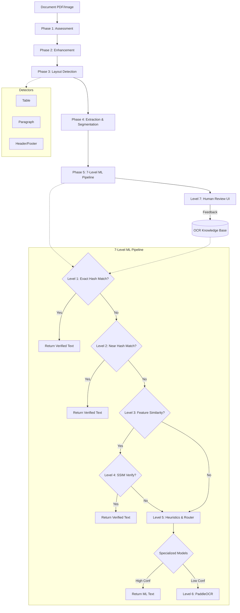

# piply-opdf

**OCR + PDF Document Understanding Framework**

A production-grade, lightweight, self-learning platform for:
- 📄 Document quality assessment
- ✨ Selective image enhancement
- 🔍 Layout detection (header, footer, table, paragraph, cell, image…)
- ✂️ Region-level extraction & Content Classification
- 🗂️ Similarity clustering & deduplication
- 🤖 OCR with confidence analysis
- 🧠 Human feedback learning *(Batch 2)*
- 🔄 Document rebuilding *(Batch 3)*

> **OCR is only one component.**
> The primary value is: **Understand Layout → Learn → Correct → Rebuild**

---

## Key Design Principles

- ⚡ **Lightweight first** — OpenCV, NumPy, PyMuPDF, ImageHash, Scikit-Learn
- 🔌 **Pluggable** — swap OCR engines, add phases, configure via YAML
- 🧩 **Independent modules** — every phase has its own public API + CLI command
- 📊 **No heavy transformers** — pure CV mathematics and analytics
- 🔁 **Self-learning** — continuous improvement from human feedback *(Batch 2)*

---

## Quick Start

```bash
# Create & activate conda environment
conda create -n py313_piply_opdf python=3.13 -y
conda activate py313_piply_opdf

# Install with PaddleOCR (primary engine)
pip install -e ".[paddle,dev]"

# Run full pipeline
piply-opdf run invoice.pdf
```

---

## Python API

```python
from piply_opdf import Document

doc = Document("invoice.pdf")

# Run individual phases
assessment = doc.assess()
enhanced_path = doc.enhance()
layout = doc.detect_layout()
manifest = doc.extract_layouts()
ocr_result = doc.ocr()

# Or full pipeline
results = doc.run_all()

print(f"Enhancement needed: {assessment.any_enhancement_needed}")
print(f"Regions detected: {len(layout.regions)}")
print(f"OCR confidence: {ocr_result.mean_confidence:.1%}")
```

---

## Architecture Flow



---

## OCR Confidence Logic

The system ranks text extraction with a confidence score from `0.0` to `1.0` (0% to 100%):

- **HUMAN (100%)**: Manual user feedback guarantees absolute correctness.
- **HASH MATCH (100%)**: Exact cryptographic `pHash` pixel matches to a human-verified image in the Knowledge Base automatically receive 100% confidence, bypassing the OCR engine entirely.
- **NEAR HASH MATCH (95%)**: Hamming distance on pHash to find very similar images.
- **ML PREDICTION (Variable)**: A predictive engine clusters similar image features (dHash, aHash, aspect ratio, edge density, Hu Moments, HOG features) to suggest likely corrections with an AI-calculated probability.
- **OCR PADDLE (Variable)**: PaddleOCR's raw bounding box probability. *Note: If the detected text bounding box touches the extreme edge of the cell crop (indicating potential partial/cut-off characters), the confidence score is strictly halved (e.g. 98% -> 49%) to forcefully flag the cell for human review.*
- **ML Cache vs Hash Match** (Explanation)
**ML CACHE**: The system recognized the exact same image crop (pixel-for-pixel or through direct identical hash cache) from a previous extraction and just skipped the OCR engine completely, returning the cached text. We skip the OCR engine entirely because we have processed the exact identical pixel-crop before.
**HASH MATCH**: The system processed the OCR, and then our new global background sync identified that the image's layout hash matches a cell a human explicitly verified in the past. It overrides the OCR with the human's verified value. Both use the image hash, but one is a speed-cache, and the other is a global human-override system. A human has verified the data of a structurally identical cell, so our background job safely overwrote the OCR output with the human's guaranteed correct value.

---

## CLI

The Piply OPDF pipeline can be run from the command line either phase-by-phase or all at once.

For full CLI documentation, including detailed command explanations and output structures, please see **[docs/cli.md](docs/cli.md)**.

```bash
piply-opdf run invoice.pdf             # All phases in sequence
```

---

## OCR Engines

| Engine | Install | Notes |
|--------|---------|-------|
| **PaddleOCR** (primary) | `pip install piply-opdf[paddle]` | Better accuracy |
| **Tesseract** (fallback) | `pip install piply-opdf[tesseract]` | Simpler install |

Configure in `config/default.yaml`:
```yaml
ocr:
  engine: paddleocr       # primary
  fallback_engine: tesseract
```

---

## Output Files

| Phase | Output |
|-------|--------|
| Assessment | `assessment.json` |
| Enhancement | `<name>_enhanced.pdf` |
| Layout Detection | `layout.json` |
| Layout Extraction | `layouts/<type>/<class>/` + `layout_manifest.json` |
| Similarity Clustering | `clusters/cluster_manifest.json` |
| OCR | `ocr_result.json` |

---

## Project Status

See **[docs/status.md](docs/status.md)** for detailed feature status.

| Batch | Phases | Status |
|-------|--------|--------|
| Batch 1 | 1–5 (Assessment → OCR) | ✅ Complete |
| Batch 2 | 6–10 (Confidence → ML Engine, Human Review, DB) | ✅ Complete |
| Batch 3 | 11–12 (Rebuilding + Web Application UI) | ✅ Complete |

---

## Development Environment

```bash
conda activate py313_piply_opdf
pip install -e ".[dev]"
pytest tests/unit/ -v
```

---

## Validation run

```bash
piply-opdf run 134242485947340351.pdf
piply-opdf run sample.pdf
piply-opdf run 2000267806.pdf
```

## License

MIT

