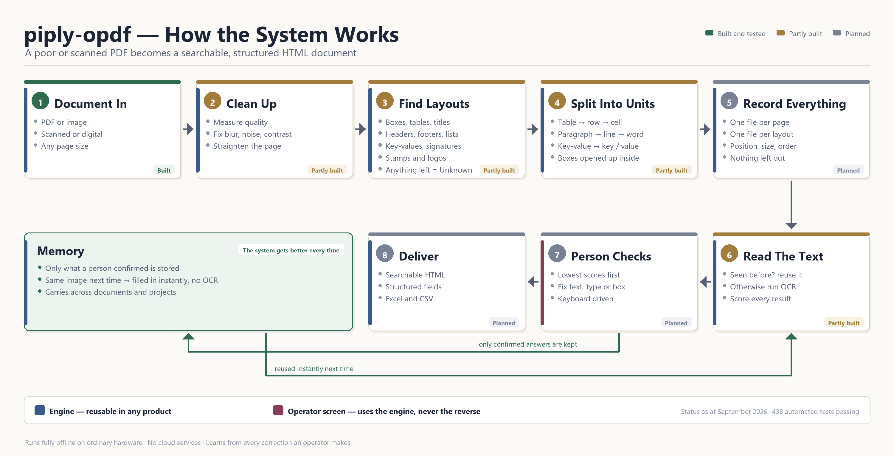
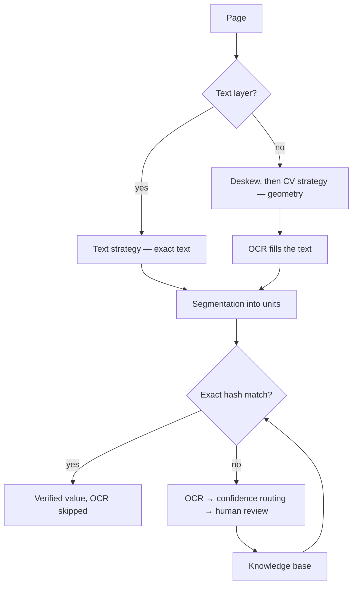

# piply-opdf

**Turn a bad or scanned PDF into a perfectly readable, parsable HTML page.**

An offline, CPU-friendly document intelligence framework. It understands
layout, learns from human corrections, and reconstructs documents — using OCR
as a last resort rather than a first step.

```bash
conda create -n py313_piply_opdf python=3.13 -y
conda activate py313_piply_opdf
pip install -e ".[paddle,dev]"

piply-opdf run invoice.pdf
```



---

## Documentation

Grouped by what you came to find out. Start with **capabilities.md** — it is the
one that says plainly what does and does not work.

### Understanding it

| Document | Purpose |
|----------|---------|
| **[capabilities.md](docs/capabilities.md)** | **What it can and cannot do.** Start here |
| [overview.md](docs/overview.md) | What it is, in one page |
| [architecture.md](docs/architecture.md) | How it works — the pipeline and the contracts |
| [components.md](docs/components.md) | The component vocabulary, and the rules that separate look-alike types |

### Using it

| Document | Purpose |
|----------|---------|
| [installation.md](docs/installation.md) | Setup and configuration |
| [usage.md](docs/usage.md) | Python API, CLI, web app, REST, OCR engines |
| [manifest.md](docs/manifest.md) | The manifest specification |
| [database.md](docs/database.md) | Schemas |

### How good is it, really

| Document | Purpose |
|----------|---------|
| [quality.md](docs/quality.md) | Accuracy targets, what is measured, and what is not |
| [audit.md](docs/audit.md) | Every sample page read against what the system produced — nine defects no metric caught |
| [testing.md](docs/testing.md) | Test catalogue and the gaps that remain |

### Where it is going

| Document | Purpose |
|----------|---------|
| [scanned-documents.md](docs/scanned-documents.md) | The scanned-PDF goal, and the challenges ranked |
| [accuracy.md](docs/accuracy.md) | How to reach maximum accuracy — and why not with a bigger model |
| [plan-templates.md](docs/plan-templates.md) | The implementation plan: quality, baseline, knowledge, templates |
| [backlog.md](docs/backlog.md) | Every tracked item, phase by phase |
| [suggestions.md](docs/suggestions.md) | Ideas waiting for a decision |

New here? Read **capabilities.md** first — it states plainly what works, what
does not, and what is guaranteed.

---

## Two guarantees

**Nothing is lost.** Every region of ink becomes a component. Content that
cannot be classified is captured as `UNKNOWN` — cropped, indexed, reviewable —
never discarded.

**Nothing is fabricated.** Text comes only from the PDF text layer, OCR, the
knowledge base, or a human. No code path synthesises or infers text. Unreadable
content stays empty rather than guessed.

---

## How it works



**Detection** finds regions. **Segmentation** splits them into the smallest
reviewable units. Every detector works on digital and scanned input alike,
choosing a strategy per page — a document and its rasterised twin produce
identical output.

---

## Component types

| Group | Types |
|-------|-------|
| Containers | `PANEL` · `TABLE` · `BORDERLESS_TABLE` |
| Textual | `TITLE` · `HEADER` · `FOOTER` · `PARAGRAPH` · `SENTENCE` · `LIST_ITEM` · `KEY_VALUE` · `ROW` · `COLUMN` · `CELL` · `WORD` |
| Graphic | `SIGNATURE` · `HANDWRITING` · `STAMP` · `LOGO` · `IMAGE` |
| Residual | `UNKNOWN` |

Look-alike types are separated by **definition, not inference**:

| Pair | Rule |
|------|------|
| Table vs Panel | ≥2 cells → table; 1 cell → panel |
| Stamp vs Logo | 1 colour → stamp; 2+ → logo |
| Signature vs Handwriting | 1–2 word-groups → signature; 3+ → handwriting |

---

## Unit hierarchy

| Layout | Units |
|--------|-------|
| Table | Row / Column → Cell |
| Panel | *(any type — recursive detection)* |
| Paragraph | Sentence → Word |
| Header / Footer / Title / List item | Word |
| Key-value | Key / Separator / Value |

Splitting key-values three ways is deliberate: `Invoice Number` recurs across
every document of a form type and is verified once; its value differs each time.

---

## Design principles

- ⚡ **Mathematics over models** — OpenCV, NumPy, PyMuPDF; anything heavier must
  justify itself against an analytic alternative
- 📴 **Offline** — no network at inference time
- 📏 **Scale-free** — thresholds are ratios or points-via-DPI, never fixed
  pixels; verified A5→Legal and 150→600 DPI
- 🔌 **Pluggable** — detectors and segmenters are strategies behind registries
- ⚖️ **Under-claim** — a missed component becomes `UNKNOWN` and a human sees it;
  a mistyped one propagates silently

---

## Status

**Works:** scanned and digital input, automatic skew correction (0.00° error
across ±8°), detection of tables, headers, footers, titles, key-values
(including multi-column forms), paragraphs, lists and graphics, segmentation to
word level, OCR with confidence routing, and a portable knowledge base.

**Does not yet work:** boxed regions (`PANEL`), stamps, borderless tables on
scans, page orientation, reading order, HTML output, ML prediction.

**Not yet measured:** detection accuracy against ground truth. The suite proves
consistency, not correctness on unseen documents.

Full detail in [capabilities.md](docs/capabilities.md).

---

## Tests

```bash
pytest tests/unit -v
```

567 tests. Corpora are generated in-process across page sizes and DPIs rather
than committed as fixtures, so tests assert general behaviour rather than
agreement with one document.

---

## License

MIT
