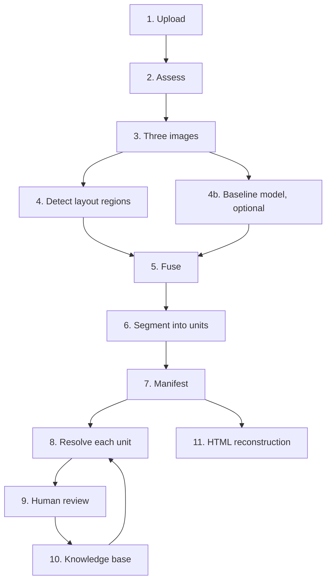
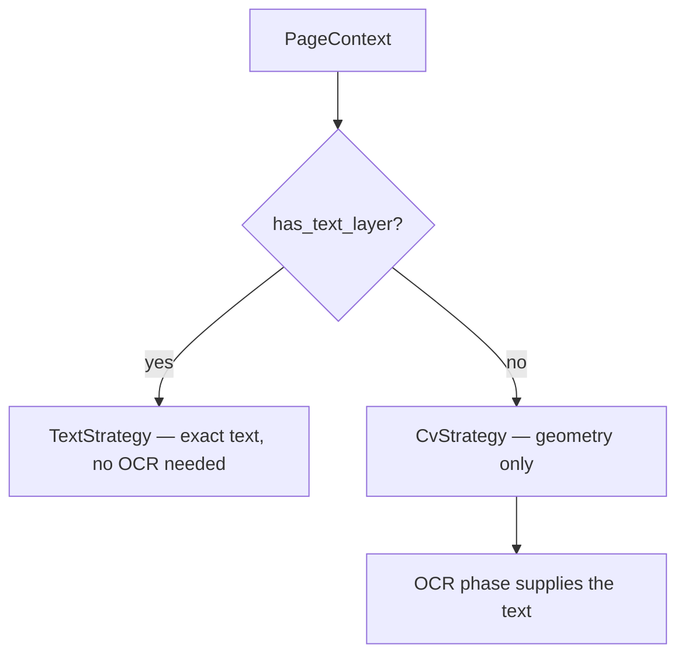

# Architecture

## Governing principle

**OCR is the last option, not the first.**

Understand the layout, reuse what has already been learned, and only then read
pixels. Every stage exists to avoid handing work to an OCR engine that could
have been answered from structure or from memory.

---

## The pipeline



Stages 4 and 6 are distinct and must not be conflated — see below. Stage 8
resolves a unit's text through the confidence ladder. Stage 10 feeds back into
stage 8: verified values are reused the next time the same image appears.

### Three images, one page

Orientation, skew and enhancement all happen at stage 3, and produce three
representations rather than one:

```
                    ORIGINAL
               immutable source of truth
                        │
              orientation + safe deskew
                        │
                   STRUCTURAL
            geometry only — no sharpening,
              no thresholding, no denoise
                        │
         ┌──────────────┴──────────────┐
         ↓                             ↓
   Layout detection            enhancement, when it helps
   Table detection                       ↓
   Fingerprinting                     WORKING
   Geometry verification                 ↓
                                        OCR
```

**Layout reads `structural`, never `working`.** Measured on `sample.pdf`, the
enhanced page lost a 171-cell table at 0.05° of rotation where the unenhanced
page survived 2°: sharpening for legibility thins the hairline rules table
detection depends on. Layout and OCR want opposite things from the same pixels.

`working` descends from `structural`, so OCR inherits the deskew. When the
assessment says no enhancement is needed, `working` **is** `structural` — the
same array, not a copy. And enhancement is discarded outright if it leaves the
page with less line structure than it started with.

### Two detectors, fused

Stage 4b is optional (`process_layout(use_baseline=True)`). A trained layout
model runs alongside the rules and the two are combined:

| | Good at |
|---|---|
| **Baseline model** | Generic regions — title, heading, text, table, figure, header, footer. Finds borderless-table regions the rules miss entirely |
| **Piply's rules** | Key-value pairs, panels, marks, cells, separators — everything specific |

Measured across the corpus, neither is a superset of the other. Fusion keeps
what each is good at, raises confidence where they agree, and **flags a
disagreement rather than resolving it silently**.

---

## Two stages: detection, then segmentation

The central structural decision.

| Stage | Question | Contract |
|-------|----------|----------|
| **Detection** | *Where are the regions?* | `Detector` + `DetectionStrategy` |
| **Segmentation** | *What are the smallest units?* | `Segmenter` + `SegmentationStrategy` |

Detection finds a paragraph. Segmentation turns it into sentences, then words.

Keeping them apart buys two things:

1. One detector serves both digital and scanned input, because *where* a
   paragraph is can be answered from a text layer or from pixels, while *what
   its words are* is a separate question with its own two answers.
2. How finely things are split can change without touching detection.

**The boundary is enforced.** Detection must not create units. When the
key-value CV strategy locates a split it records the geometry in metadata; the
segmenter turns that into `KEY`/`SEPARATOR`/`VALUE`. A detector that attached
children directly would pre-empt segmentation, and the separator unit would
never be produced. There is a test asserting detectors create no units.

---

## Strategy selection

Every detector owns one or more strategies and delegates to the first
applicable one for the page at hand.



This is what lets a single `HeaderDetector` serve a digital PDF and a scan.
`TextHeaderStrategy` declines when the page has no embedded text;
`CvHeaderStrategy` picks it up.

**Why it matters:** header, footer, paragraph, key-value, list-item and
borderless-table detection were originally built only on PyMuPDF's text layer.
On a scanned document they returned nothing, so such pages yielded tables and
nothing else. Only table detection, being OpenCV-based, worked at all.

Adding a new approach means adding a strategy. Detectors, the pipeline and
persistence are untouched — open for extension, closed for modification.

---

## Core contracts

```
piply_opdf/
├── core/           the contracts everything else speaks
│   ├── types.py        BBox, PageContext, DetectedComponent, ComponentType
│   ├── detector.py     DetectionStrategy, Detector, DetectorRegistry
│   ├── segmenter.py    SegmentationStrategy, Segmenter, segment_tree
│   └── exceptions.py   PiplyError hierarchy
├── quality/        assess, enhance, orientation, the three images, metrics
├── detectors/      the rules: table, panel, key-value, header, graphic …
├── segmentation/   splitting a region into its units
├── baseline/       adapter for the trained layout model  (optional)
├── fusion/         combining baseline regions with rule detections
├── ocr/            engine registry — PaddleOCR primary, swappable
├── classification/ what a non-prose region is
└── knowledge/      verified content, reused
```

| Type | Role |
|------|------|
| `PageContext` | One page: the rendered raster plus a lazily probed text layer. `has_text_layer` is the strategy discriminator. |
| `BBox` | Axis-aligned `(x, y, w, h)` with overlap and exclusion helpers |
| `DetectedComponent` | What every detector returns: id, type, page, bbox, text, confidence, ordinal, children, provenance |
| `Detector` / `Segmenter` | Own ordered strategies; pick the first applicable |
| `DetectorRegistry` | Factory keyed by component type, so the pipeline holds no hard-coded imports |
| `PageImages` | The three representations of one page: `original`, `structural`, `working` |
| `OCREngine` / `OCRResult` | The reading contract. A result carries **which engine read it** and why it is trusted |
| `FusionOutcome` | What combining two detectors produced, and what disagreed |

**Three registries, one pattern.** Detectors, segmenters and OCR engines are all
registered by name and built by a factory, so adding one is a file and a
decorator rather than an edit to the pipeline.

---

## Coordinates

PyMuPDF reports geometry in **PDF points** (72/inch). The pipeline works on
rasters rendered at `PageContext.dpi`, 300 by default. Every `BBox` stored on a
component is in **pixels at the page's render DPI**; `PageContext.to_pixels()`
converts.

### Scale-free thresholds

Thresholds are expressed as **ratios, or in typographic points converted via
DPI** — never as fixed pixel counts.

```python
MIN_TEXT_HEIGHT_PT = 3.0     # not "8 pixels"
kernel_w = int(line.height * 0.22)   # not "6 pixels"
```

A fixed pixel value silently encodes an assumption about page size and
resolution. Tests generate corpora across A5→Legal and 150→600 DPI
specifically to catch violations.

---

## Exclusions

Each detection stage passes its output as exclusions to the next, so a region
is claimed once. Two details matter.

**Coverage is cumulative, not per-box.** A form row holding two key-value pairs
is only ~45% covered by each pair individually; a per-box test lets it through
and the row is re-reported as prose. `BBox.is_excluded_by` measures combined
coverage.

**CV strategies mask, they do not filter.** Excluded regions are erased from
the binary image *before* lines are grouped. A header directly above a table
would otherwise merge into one block with the table's first rows, and
discarding that block would lose the header along with it.

---

## Skew correction

Applied at page level, before any detector runs.

**Method — projection-profile sharpness maximisation.** When text lines are
horizontal the row-wise ink projection is spiky: dense rows through the lines,
near-empty rows between. Rotation smears the peaks. The correct angle maximises
summed squared difference between adjacent rows.

Preferred over Hough line detection: Hough needs long straight lines, which
prose does not have, and is easily dominated by table rules or a page border.
Projection sharpness responds to the text itself. Search is coarse-to-fine on a
downscaled copy — a page's angle does not depend on its resolution.

**Page level, not per component.** Rotating a page is one affine warp. Rotating
components individually puts every bounding box in its own rotated frame,
making the manifest and reconstruction intractable to reassemble.

**The page frame is preserved.** Expanding the canvas to avoid clipping corners
adds blank margin — and since every zone downstream is a *ratio of page height*
(header = top 12%), that margin shifts the bands off their content. Preserving
the frame matters more than preserving corners, which on a scan are margin.

**Only pages without a text layer.** A PDF carrying embedded text reports
coordinates in the original frame, so rotating the raster would leave image and
text layer in different coordinate systems. Digital pages are not skewed
anyway — skew is a scanning artefact.

---

## Content classification

One classifier rather than four detectors. Signature, handwriting, stamp, logo
and photograph all need the same measurements from the same crop; four separate
page scans would be wasteful and would let the four disagree about one region.

Measured per region, all scale-free: ink ratio, component density, component
area variation, stroke width variation, saturation, colour richness, edge
density, aspect ratio, row coverage.

Boundaries between similar types are set by **definition**, not inference —
cell count for table vs panel, colour count for stamp vs logo, word-group count
for signature vs handwriting. See [components.md](components.md#decision-rules).

### Classifier as a guard

The paragraph and title CV strategies consult the classifier before claiming a
region: ink is not automatically text. Without the check, a photograph in the
body zone becomes a "paragraph" and a logo in the top band becomes a "title" —
mislabelling them *and* hiding them from the residual sweep.

They reject only *confident* graphics. `UNKNOWN` stays text: this is a
text-first pipeline, and misfiling real prose as an unclassified graphic loses
it from OCR entirely, whereas the reverse merely yields a low-confidence
paragraph.

---

## Confidence ladder

How a unit's text is resolved, cheapest first.

| Level | Source | Confidence | Bypasses review? |
|-------|--------|-----------|------------------|
| 1 | Human verification | 100% | *is* the source of truth |
| 2 | Exact pHash match | 100% | ✅ yes |
| 3 | Near-hash match | 95% | ❌ suggestion only |
| 4 | ML prediction | variable | ❌ *(not implemented)* |
| 5 | OCR | variable | ❌ confidence-routed |

**Only exact, human-trusted matches bypass review.** Near-hash, SSIM,
histogram and projection similarity may inform ML features or review hints, but
must never auto-fill: visually similar crops can contain different text.

**OCR confidence is halved when the crop's own ink reaches its border** — a
direct sign the region was cut through its content, so part of it never reached
the engine. Verified: a crop sliced through a leading `4` reads `43438` as
`13438` at confidence 1.0, and is marked down to 0.50.

Measured on the crop, **not** on the engine's detected boxes: PaddleOCR's boxes
routinely extend 11–15 px into the padding, so testing those fired on every crop
and halved every confidence, which made the penalty meaningless.

### A caution about these numbers

Levels 1 and 2 are real: a human verified it, or the image is the same image.
**Everything below that is a literal written into the code** — a paragraph is
always 0.70, a logo always 0.85. They mean "this rule fired", not "right this
often", and nothing records *why* a region scored what it did.

Measured on `sample.pdf`, to be precise about it: the 202 stored components
carry 45 distinct confidences between 0.25 and 1.0, so they are not all alike.
But 199 of those 202 are cells, rows and columns whose number comes from the
grid builder, and the three detector-level regions are literals. A cell at 0.50
and a header at 0.85 are not on the same scale, so a single threshold across
them compares things that were never comparable — which is why cutting at 0.95
selects 167 of the 202.

---

## Confidence as evidence

`piply_opdf/confidence/` replaces the literal with a number **derived from six
named signals**, so a score can be taken apart afterwards.

| Signal | Weight | Measurable today |
|--------|--------|------------------|
| `detector_evidence` — how strongly the rule fired | 3 | ✅ the existing literal, kept as *one* input |
| `knowledge_agreement` — does the layout knowledge base concur | 3 | ❌ needs the LayoutPredictor (Phase T) |
| `geometry_evidence` — does the shape agree with the claimed type | 2 | ✅ |
| `structural_evidence` — does the ink support it | 2 | ✅ from `classification.measure` |
| `model_confidence` — the baseline's own score | 2 | ✅ when the baseline ran |
| `historical_reliability` — how often this detector was right | 1 | ❌ needs the feedback log |

Three rules decide how they combine:

**Missing is not zero.** A signal nobody could measure is `None` and takes no
part in the average. Scoring it as 0 would punish a region for the pipeline's
gaps rather than its own weakness — and four of the six are frequently
unmeasurable today, so this is not a corner case. The signals turn on by
themselves as data arrives, with no code change.

**One contradiction outranks a good average.** Five agreeable signals and one
saying 0.1 is not a 0.75 component; it is a component with something wrong with
it. The average stays honest and the *decision* to review is taken separately —
bending the number would make it both a worse ranking and a worse explanation.

**It is a ranking, not a probability.** The weights are argued, not fitted.
`Confidence.calibrated` is `False` everywhere until the Phase E corpus can say
what a 0.90 is worth. So the primary control is **capacity** — `review_queue`
returns the worst *N*, which a ranking can answer — rather than a threshold,
which it cannot.

`historical_reliability` is weighted lowest on purpose. A detector that has
been right 90% of the time is not thereby right about *this* region, and a good
track record carrying the score would hide exactly the cases worth catching.

**Wired in at stage 9**, after fusion so the baseline's opinion is included.
The itemised evidence is written to `components.evidence_json` and shown in the
review screen's *why* panel.

**It does not reach table cells.** Cells, rows and columns are built after
stage 9 and numbered by the grid builder, so on `sample.pdf` 200 of 202
components carry a confidence with no account of it. Backlog I26.

---

## Knowledge bases

Learning is reusable across projects, so it lives in its own portable database
separate from working state. There are two, kept in separate files because they
answer different questions and one is worth sharing without the other.

### Text knowledge — "what does this say?"

```
Image → pHash → verified text → confidence → features
```

Clusters are assigned by **image similarity, not text equality** — visually
near-identical crops group together even when OCR read them differently, which
is what makes a cluster useful as training data.

### Layout knowledge — "what kind of region is this?"

```
Region → ratios + relationships → verified type → version block
```

Nothing in it is measured in pixels, because a pixel means a different thing at
every scanner setting. A record is *where it sits as a fraction of the page*,
*what is next to it*, and *how the ink looks* — the last measured by
`classification.measure`, the same function the classifier uses, so a stored
record and a live region cannot drift apart.

The relationships are the part that transfers. A logo is a colourful blob in a
corner **above a heading**; a header row is text **above rows sharing its column
edges**. Strip the neighbours out and every wide dark strip near the top of a
page looks alike.

Two rules are enforced in code, not documented and hoped for:

| Rule | Where | Why |
|------|-------|-----|
| Only `human` and `manual_import` sources enter | `remember()` raises otherwise | A detector's opinion is output, not truth. Letting it in is how one unchecked mistake becomes a learned rule |
| Matching never crosses a feature version | `candidates()` filters | Features from a different extractor are not comparable. Old knowledge that silently answers is worse than none, because nothing about the answer looks wrong |

Human corrections are logged as **five distinct actions** —
`CONFIRMED / CORRECTED / ADDED / DELETED / REJECTED` — rather than one
agree/disagree flag, because finding a region and naming it correctly are
different skills that need opposite fixes.

**Built and empty.** The store works and is tested; nothing in the running
system writes to it yet. See K5 in [backlog.md](backlog.md).

Schemas: [database.md](database.md). The working database (`piply_opdf.db`) is
disposable — delete and reprocess. The knowledge databases are the asset.

---

## Design constraints

| Constraint | Consequence |
|------------|-------------|
| **Mathematics over models** | OpenCV, NumPy, PyMuPDF. Anything heavier justifies itself against an analytic alternative |
| **Offline** | No network at inference. Rules out cloud OCR, remote models, webfonts |
| **CPU-friendly** | No GPU requirement |
| **Scale-free** | Ratios and points, never fixed pixels |
| **Nothing lost** | Unclassifiable content is captured, not discarded |
| **Nothing fabricated** | Text only from text layer, OCR, knowledge or human |
| **Under-claim** | A missed component is recoverable; a mistyped one propagates silently |

Patterns in use: Strategy (detection and segmentation), Factory + Registry
(detector/segmenter creation), Repository (knowledge storage), Dependency
Injection (strategies into detectors).
