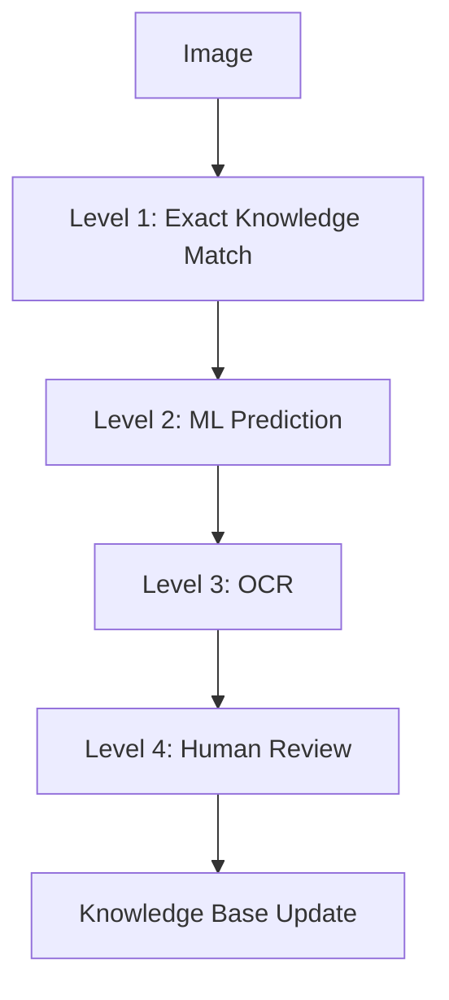

# Architecture & Core Modules

## Knowledge First Strategy

The core architectural tenet of Piply OPDF is that **OCR is the last option rather than the first option**, but only exact, human-trusted knowledge may bypass review. Near-hash or similarity matches must not auto-fill trusted values because visually similar cells can contain different text.

Before calling OCR engines, the system follows this trust-aware pipeline:

### Learning Levels

1. **Level 1 - Exact Match**: Instantly return a previously learned value only when the current image hash exactly matches a human-trusted knowledge entry. This appears under the `EXACT HASH MATCH` review filter.
2. **Level 2 - ML Prediction**: Use lightweight ML models trained from the Knowledge DB to predict values when no exact hash exists. ML predictions are suggestions until accepted by a human.
3. **Level 3 - OCR**: Fallback processing mechanism using configured OCR engines (e.g., PaddleOCR, Tesseract).
4. **Level 4 - Human Review**: Final validation layer. Any accepted or edited OCR/ML value becomes trusted feedback and is written to the Knowledge DB.

Near-hash, SSIM, histogram, projection-profile, and edge-density similarity may be used as ML features or review hints, but they must not create automatic trusted feedback.

## Feature Extraction

To power exact matching, learning, and ML prediction, the system must extract and store reusable image features for each component:
* pHash
* dHash
* aHash
* Width & Height
* Aspect Ratio
* Edge Density
* Histogram Features
* Projection Profiles

## Knowledge Base

Learning must be reusable across projects. The system maintains a global Knowledge Base mapped as follows:

`Image` → `Hash` → `Text Value` → `Confidence` → `Metadata`

*The primary rule: The same exact learned image should never require human review again. Similar images require ML/OCR prediction plus human review unless confidence policy later defines a separate safe path.*

## Object-Oriented Design Principles

To maintain coding standards, scalability, and optimized code, the framework must maximize the use of Object-Oriented Programming (OOP) principles:

* **Encapsulation** for module-level responsibility management.
* **Abstraction** through interfaces and base classes.
* **Inheritance** where appropriate for reusable behaviors.
* **Polymorphism** for interchangeable processing engines and strategies.
* **SOLID** principles should be strictly followed.

### Required Design Patterns
The architecture should utilize specific patterns where beneficial:
* Factory Pattern
* Strategy Pattern
* Builder Pattern
* Repository Pattern
* Observer Pattern
* Dependency Injection

## Suggested Core Modules

The architecture should be divided into the following loosely coupled, highly cohesive modules. Each module must expose clear interfaces so that implementations can be replaced or upgraded independently.

1. **Document Processor**
2. **Layout Detector**
3. **Layout Extractor**
4. **Content Segmenter**
5. **Knowledge Matcher**
6. **Similarity Engine**
7. **Feature Extractor**
8. **ML Prediction Engine**
9. **OCR Engine**
10. **Human Review Manager**
11. **Learning Engine**
12. **Knowledge Base Manager**
13. **Document Reconstruction Engine**
14. **Export Manager**
15. **Configuration Manager**
