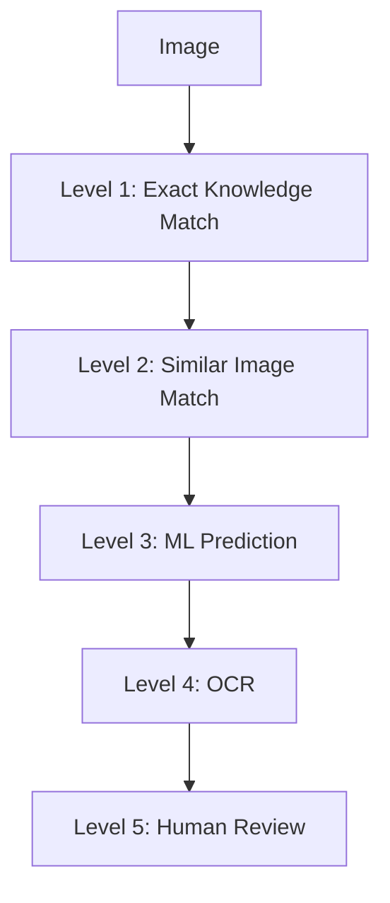

# Architecture & Core Modules

## Knowledge First Strategy

The core architectural tenet of Piply OPDF is that **OCR is the last option rather than the first option.** Before calling OCR engines, the system attempts to resolve text through a 5-Level Learning pipeline:

### Learning Levels

1. **Level 1 - Exact Match**: Instantly return a previously learned value using perceptual hashes (pHash, dHash, aHash).
2. **Level 2 - Similarity Matching**: Find visually similar content using Structural Similarity Index (SSIM), Histogram Similarity, Projection Profiles, and Edge Density.
3. **Level 3 - ML Prediction**: Utilize lightweight ML models (KNN, Random Forest, SVM) *only after* sufficient labeled data has been collected. (No deep learning or transformers).
4. **Level 4 - OCR**: Fallback processing mechanism using configured OCR engines (e.g., PaddleOCR, Tesseract).
5. **Level 5 - Human Review**: Final validation layer for low-confidence outputs, looping back into the Knowledge Base.

## Feature Extraction

To power clustering, learning, and ML prediction (Levels 1-3), the system must extract and store reusable image features for each component:
* pHash
* dHash
* aHash
* Width & Height
* Aspect Ratio
* Edge Density
* Histogram Features
* Projection Profiles

## Knowledge Base

Learning must be reusable across projects. The system maintains a global Knowledge Base mapped as follows:

`Image` → `Hash` → `Text Value` → `Confidence` → `Metadata`

*The primary rule: The same learned image should never require human review again.*

## Object-Oriented Design Principles

To maintain coding standards, scalability, and optimized code, the framework must maximize the use of Object-Oriented Programming (OOP) principles:

* **Encapsulation** for module-level responsibility management.
* **Abstraction** through interfaces and base classes.
* **Inheritance** where appropriate for reusable behaviors.
* **Polymorphism** for interchangeable processing engines and strategies.
* **SOLID** principles should be strictly followed.

### Required Design Patterns
The architecture should utilize specific patterns where beneficial:
* Factory Pattern
* Strategy Pattern
* Builder Pattern
* Repository Pattern
* Observer Pattern
* Dependency Injection

## Suggested Core Modules

The architecture should be divided into the following loosely coupled, highly cohesive modules. Each module must expose clear interfaces so that implementations can be replaced or upgraded independently.

1. **Document Processor**
2. **Layout Detector**
3. **Layout Extractor**
4. **Content Segmenter**
5. **Knowledge Matcher**
6. **Similarity Engine**
7. **Feature Extractor**
8. **ML Prediction Engine**
9. **OCR Engine**
10. **Human Review Manager**
11. **Learning Engine**
12. **Knowledge Base Manager**
13. **Document Reconstruction Engine**
14. **Export Manager**
15. **Configuration Manager**
