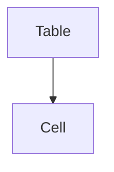
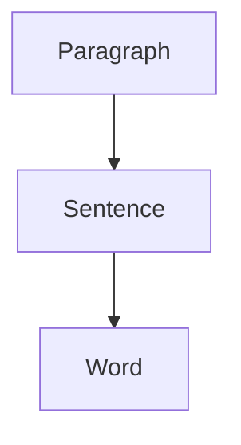
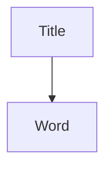
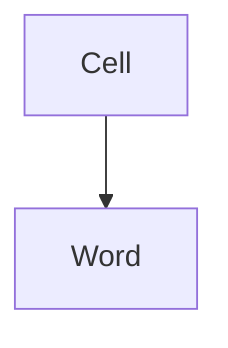
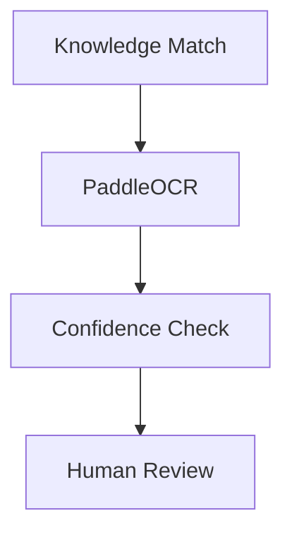

# Business Rules & Logic

## OCR Units

OCR and learning operations must operate on the smallest meaningful unit for maximum reusability and accuracy.

### Tables


### Paragraphs


### Titles


### Handwritten Content


## Recommended OCR Strategy

When a component fails Level 1-3 learning checks and reaches the OCR stage, it should follow this recommended pipeline:



## Confidence Rules

The framework uses strict confidence routing to balance automation with data integrity:

* **≥ 95%** → Auto Accept
* **90–95%** → Optional Review
* **< 90%** → Review Required
* **< 70%** → High Priority Review

## Human Feedback Loop

The system becomes intelligent entirely through the Human Feedback loop. When low-confidence predictions require intervention, the process is:

```text
Image → OCR Result → Human Correction → Knowledge Base Update
```

**Example:**
* System predicts: `POL1CY`
* Human corrects to: `POLICY`

**Storage Action:**
The correction must immediately become reusable globally by storing:
1. Image Hash (e.g., pHash, dHash, aHash)
2. Actual Value (`POLICY`)
3. Confidence (100% since human verified)
4. Source (User/Human)

The next time an identical or highly similar component passes through the framework, it will be automatically resolved by the Level 1/Level 2 matchers.
