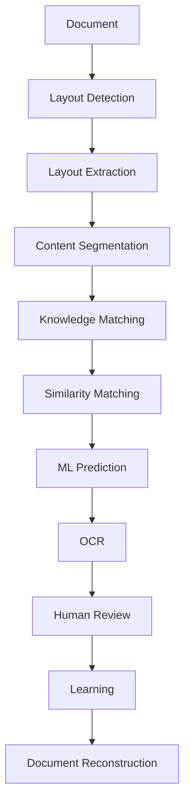

# Piply OPDF Overview

## Vision

Piply OPDF is evolving beyond a traditional OCR system into a lightweight, self-learning document intelligence framework capable of understanding, extracting, correcting, and reconstructing information from PDFs and images. 

The primary goal is to **minimize OCR dependency** by leveraging knowledge reuse, image similarity, machine learning, and human feedback.

## Processing Workflow

The system processes documents through a structured pipeline aimed at extracting maximum intelligence before resorting to raw OCR:

## Layout Components

The system detects and extracts the following structural components:
* Tables
* Borderless Tables
* Cells
* Paragraphs
* Sentences
* Titles
* Headers
* Footers
* Key-Value Pairs
* Logos
* Images

Each component is stored independently with its own metadata. Every processed PDF or image maintains a **master manifest** that captures the document structure, relationships, and component references. This enables the accurate reconstruction of the original document in structured HTML format.

## Long-Term Goal

Transform Piply OPDF from a standard **OCR System** into a **Self-Learning Document Intelligence Platform** that continuously improves through:
* Knowledge Reuse
* Similarity Detection
* Human Feedback
* Lightweight Machine Learning

while remaining:
* Offline
* CPU Friendly
* Lightweight
* Fast
* Highly Accurate
* Domain Independent
